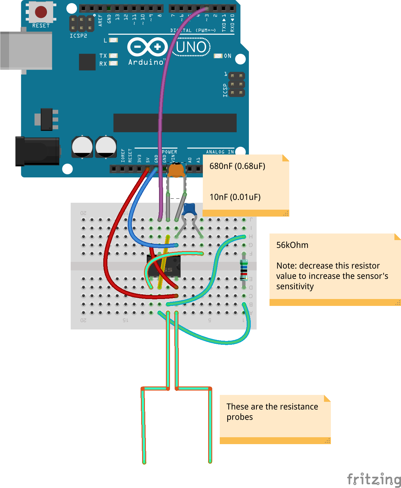

Soil-Moisture-Sensor
====================

This is a schematic and code for creating a 555 based soil-moisture-sensor based on the resistance of the soil.

Because this depends on the frequency of oscillation, we can increase our sensor's sensitivity by **decreasing** the overall resistance.

## Schematic

follow the following wiring schematic to create the sensor

## BOM

| Amount | Part  |
| :---   |  :--- |
| 1 | 0.68 nF (680pF) Ceramic Capacitor |
| 1 | 10 nF (0.01uF) Ceramic Capacitor |
| 1 | 56kOhm Resistor |
| 1 | 555 Timer |

## Code

The code relies on hardware interrupts, and they are different pins on different models.

Here is a linke to the Arduino Site for interrupt pins and documentation:
http://arduino.cc/en/Reference/attachInterrupt

